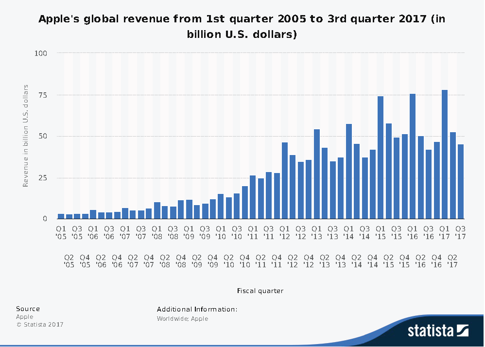

```{r setup, include=FALSE}
knitr::opts_chunk$set(echo = TRUE)
```

# Introducción

El objetivo del presente trabajo es predecir las ventas de Apple. Para ello, se ha acudido a Bloomberg para obtener los datos trimestrales desde el 2T de 2008 hasta el 3T del 2017.

Se debe elegirá el modelo ETS y el modelo ARIMA que mejor prediga las ventas, habiendo dejado fuera de la estimación los trimestres del 2017.

Una vez seleccionado el modelo, se estimará el modelo con todos los datos y se harán las predicciones del año 2017 y 2018.



***

# Importación de librerías y datos

```{r, message=FALSE, warning=FALSE}
library(tidyverse)
library(readr)
library(skimr)
library(janitor)
library(forecast)
library(magrittr)
library(xts)
library(ggplot2)
library(ggfortify)
```

```{r}
apple <-  read.csv("../data/IngresosApple.csv", sep = ";")
head(apple)
```

# Transformación e interpretación del DataFrame 


Primero, se genera una variable xts para poder transformarla por trimestres y en *zoo data*.
```{r}
rawData <- seq(as.Date("2008/04/01"), as.Date("2017/09/30"), by = "quarter")

xApple <- xts(apple$Ingresos, order.by = rawData)
xApple <- to.quarterly(xApple)

zApple=as.zoo(xApple$xApple.Close)
```


Se representan los trimestres para poder observar su comportamiento individual a lo largo de los años del estudi (2008-2018)
Nótese que la línea azul horizontal es la **media de ingreso por trimestre**.
```{r}
tApple <- ts(coredata(zApple), start = c(2008,2), frequency = 4)
ggfreqplot(tApple, freq = 4, nrow = 1, facet.labeller = c('Q1','Q2','Q3','Q4')) + ggtitle('Ingresos por trimestre')

```
Se aprecia que el cuarto trimesrte tiene los **ingresos más altos del año**.

También se puede observar la evolución en una única línea temporal. 
```{r}
autoplot(tApple)+ggtitle('Ingresos de Apple desde 2008 a 2018')+
  xlab('')+ylab('Ingresos')
```

Por lo tanto, estas observaciones probienen de una distribución que es diferente en cada instante del tiempo, es decir, no es estacionaria, ya que como se aprecia en el gráfico de *ingresos de Aplle desde 2008 a 2018*, va en aumento a medida que aumentan los años. 
La variación del periodo 2008-2012 es diferente de la del periodo 2012-2018, por lo que no es estacionaria en varianza, y de media como se aprecia, tampoco. El modelo de serie temporal parece, por tanto, tener una **tendencia exponencial al alza con estacionalidad multiplicativa** 

# Componentes de la serie temporal

Se supone que la serie temporal es la suma de varias componentes = **tendencia** (*trend*), **estacionalidad** (*seasonal*) e **irregular** (*remainer*).

En la siguiente tabla se puede ver cada componente del DataFrame del estudio.
```{r}
stl(tApple[, 1], s.window = "periodic")

plot(stl(tApple[, 1], s.window = "periodic"))
```

***

# Selección del modelo ETS

Previamente se crará una muestra sin los últimos tres trimestres para poder probar el modelo predictivo más adelante.

```{r}
cOmit=3
nObs = length(zApple)
oApple <- window(zApple,start=index(zApple[1]),end=index(zApple[nObs-cOmit]))
```


Se selecciona de manera automática el ETS y se crea un modelo de predicción con la muestra:
```{r}
etsfit <- ets(oApple)
etsfit
fApple.ets <- forecast(etsfit)
summary(fApple.ets)
```

Que graficado por trimestres, tiene la siguiente forma:
```{r}

plot(fApple.ets)
lines(window(zApple),type="o")
```

# Diferencias entre la predicción y los valores reales

Se aprecia cómo predice con un ligero error, sobretodo en el primer trimestre.
```{r}
matrix(c(fApple.ets$mean[1:cOmit],zApple[(nObs-cOmit+1):nObs]),ncol=2)
```

```{r}
etsfit<-ets(window(tApple,end=2016+3/4))
fventas.ets=forecast(etsfit,h=cOmit)
forecast:::testaccuracy(fApple.ets$mean,window(tApple,start=2017),test = NULL, d = NULL, D = NULL)

```


# Tranformación serie temporal para que sea estacionaria

Bajo el supuesto que una serie no es estacionaria en media y varianza, debemos realizar en primer lugar la transformación de la serie para conseguir que sea *estacionaria en varianza* y luego la transformación para obtener la *estacionariedad en media*.


## Estacionariedad en varianza

Para ello se realizará una transformación logarítmica. Así se puede apreciar a continuación el primer gráfico, con la variable sin transformar, y el segundo, donde la serie es estacionaria en varianza después de la transformación logarítmica.

```{r}
df_new <- data.frame(value = as.vector(zApple),
                     time = time(zApple))
ggplot(df_new)+geom_point(aes(x=time,y=value))+geom_line(aes(x=time,y=value))+ylab("Ingresos")+ggtitle("Ingresos trimestrales Apple")+xlab("Trimestres")
```


```{r}
zlApple=log(zApple)
df_newl <- data.frame(value = as.vector(zlApple),
                     time = time(zlApple))
ggplot(df_newl)+geom_point(aes(x=time,y=value))+geom_line(aes(x=time,y=value))+ylab("Ingresos")+ggtitle("Ingresos trimestrales LOG Apple")+xlab("Trimestres")
```

## Estacionariedad en media

La transformación consiste en la aplicación del operador diferencia (realizar diferencias) hasta obtener una serie ya estacionaria. Además, la función de autocorrelación simple (**ACF**) se representa gráficamente dando valor a la autocorrelación para cada retardo y graficando las dos intervalos de confianza que permiten determinar si el coeficiente de autocorrelación es cero o no. Esto es importante porque cuando una serie temporal es estacionaria, la información histórica relevante es la mas cercana, así cuando se calcula la autocorrelación de retardos alejados en el tiempo se debe esperar obtener un valor pequeño o cero.

Adicionalmente de calcula la función de autocorrelación parcial (**PACF**), mediante una regresión  donde cada valor de la función es el parámetro estimado del último retardo incluido en la regresión. La diferencia entre la *acf* y la *pacf*, es que en la *pacf*  elimina los efectos indirectos. 

Se define primero el **operador retardo**, que permite retardar una serie temporal:

```{r}
ggtsdisplay(zlApple)
```
En este caso, el **ACF** de los retardos alejados se sale de las bandas de los intervalos de confianza, por lo que la autocorrelación no es cero, lo que significa que la serie temporal **no es estacionaria**.


La **diferencia de primer orden** consiste en restar a la serie original la misma serie pero retardar un periodo:
```{r}
ggtsdisplay(diff(zlApple))
```
En este caso la autocorrelación de orden elevado (12) tiene un valor significativo distinto de cero, por lo que la serie temporal **sigue sin ser estacionaria**.


La **diferencia de segundo orden** consiste en aplicar dos veces la diferencia a la serie original, o una diferencia a la serie ya diferenciada:
```{r}
ggtsdisplay(diff(diff(zlApple,3),1))
```


# Modelo ARIMA

Cuando la serie temporal es estacional, se tiene que modelizar el componente estacional con un modelo ARIMA adicional.

```{r}
#ARIMA MODEL
fit1=auto.arima(oApple,lambda=0)
summary(fit1)
```


```{r}
#residual analysis
ggtsdisplay(fit1$residuals)
```

### Test Box-Ljung

El test Box-Ljung consiste en contrastar si los retardos de la acf son cero a la vez. Si el valor-p es inferior a los valores del nivel de significación rechazamos que sea ruido blanco y el modelo no sería correcto.
```{r}
#box-Ljung Test
Box.test(fit1$residuals,lag=4, fitdf=3, type="Lj")
```


```{r}
fApple.arima=forecast(fit1)

ggplot(df_new)+geom_point(aes(x=time,y=value))+geom_line(aes(x=time,y=value))+ geom_forecast(fApple.arima,alpha=0.4)+ggtitle("ARIMA: Predicción Apple")

```

```{r}
fApple.arima
```

